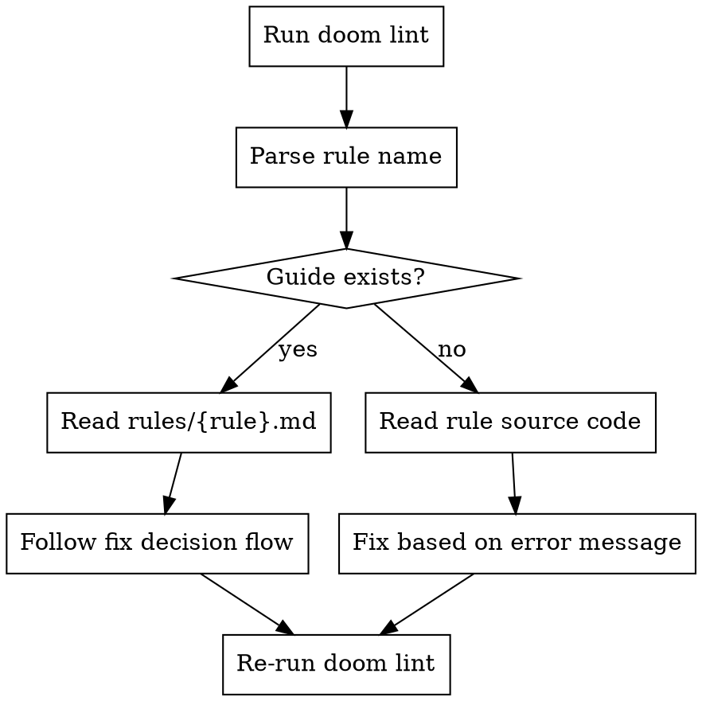

# Doom Lint Fix Guide

## Overview

This skill routes `doom lint` errors to rule-specific fix guides. Each guide contains the error message anatomy, fix decision flow, fix patterns with examples, and common mistakes to avoid.

**There is no `--fix` option** — all fixes are manual. This skill tells you exactly how to fix each rule violation.

## When to Use

- `doom lint` reports any `doom-lint:*` error
- You're fixing lint errors in markdown (`.md`) or MDX (`.mdx`) documentation files
- You need to understand what a doom-lint rule expects

## Rule Coverage

| Rule                            | Fix Guide                                                            | Status                |
| ------------------------------- | -------------------------------------------------------------------- | --------------------- |
| `no-unmatched-anchor`           | [rules/no-unmatched-anchor.md](rules/no-unmatched-anchor.md)         | ✅ Documented         |
| `no-multi-open-api-paths`       | [rules/no-multi-open-api-paths.md](rules/no-multi-open-api-paths.md) | ✅ Documented         |
| `check-dead-links`              | —                                                                    | ⬜ Not yet documented |
| `list-item-punctuation`         | —                                                                    | ⬜ Not yet documented |
| `list-item-size`                | —                                                                    | ⬜ Not yet documented |
| `list-table-introduction`       | —                                                                    | ⬜ Not yet documented |
| `maximum-link-content-length`   | —                                                                    | ⬜ Not yet documented |
| `no-deep-heading`               | —                                                                    | ⬜ Not yet documented |
| `no-deep-list`                  | —                                                                    | ⬜ Not yet documented |
| `no-empty-table-cell`           | —                                                                    | ⬜ Not yet documented |
| `no-heading-punctuation`        | —                                                                    | ⬜ Not yet documented |
| `no-heading-special-characters` | —                                                                    | ⬜ Not yet documented |
| `no-heading-sup-sub`            | —                                                                    | ⬜ Not yet documented |
| `no-paragraph-indent`           | —                                                                    | ⬜ Not yet documented |
| `site`                          | —                                                                    | ⬜ Not yet documented |
| `table-size`                    | —                                                                    | ⬜ Not yet documented |
| `unit-case`                     | —                                                                    | ⬜ Not yet documented |

## How to Use

1. Identify the rule name from the `doom lint` output (e.g., `doom-lint:no-unmatched-anchor`)
2. Find the rule in the table above
3. If documented: read the corresponding file in `rules/` and follow its fix decision flow
4. If not yet documented: read the rule source in `packages/doom/src/remark-lint/` to understand what it checks, then fix accordingly

## Fix Workflow

## Batch Fix Strategy

When `doom lint` reports many errors across multiple rules:

1. Run `doom lint` and capture all output
2. Group errors by **rule name**
3. For each rule group, follow the rule-specific batch fix strategy (documented in each rule guide)
4. Process one rule at a time to avoid conflicting edits
5. Re-run `doom lint` after fixing each rule group to verify and catch cascading fixes

## General Principles

- **Fix the source, not the symptom** — if a heading needs an anchor, add it to the heading, don't change the link
- **Fix all translations** — anchor IDs, heading custom IDs must be consistent across all language variants
- **One write per file** — batch all fixes for a file into a single edit to avoid repeated I/O
- **`.md` vs `.mdx` syntax matters** — MDX requires escaping `{#id}` as `\{#id}` due to JSX expression parsing
- **Re-run after fixing** — some fixes can introduce new errors or resolve cascading ones
