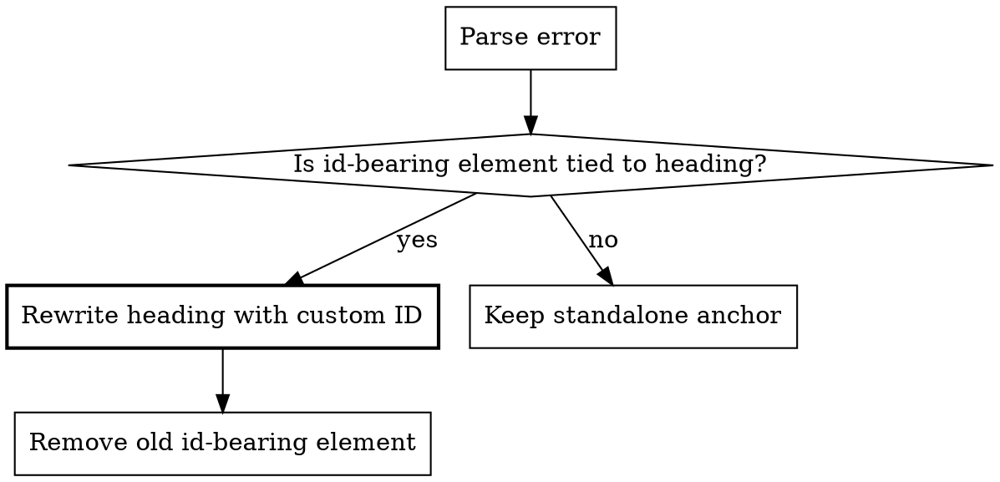

# Fixing Heading Anchor Format Errors

## Overview

The `doom-lint:heading-anchor-format` rule enforces that heading anchors are expressed directly on the heading with a custom ID, not with nearby HTML or JSX elements carrying `id` attributes.

**Core principle:** If an `id` is logically attached to a heading, rewrite it as `{#custom-id}` in `.md` files or `\{#custom-id}` in `.mdx` files. Do not keep `<a id="..."></a>`, `<span id="..."></span>`, or similar id-bearing elements inside the heading or immediately adjacent to it.

## When to Use

- `doom lint` outputs: `Unexpected id-bearing element ... associated with a heading ...`
- A heading contains raw HTML with `id=...`
- A heading contains JSX or HTML siblings with `id=...` immediately before or after the heading
- Existing docs use `<a id="..."></a>` or `<span id="..."></span>` to anchor headings

## Error Message

```text
Unexpected id-bearing element `{element}` associated with a heading, rewrite it to `{heading}` instead.
```

| Field     | Meaning                                                             |
| --------- | ------------------------------------------------------------------- |
| `element` | The HTML/JSX snippet carrying the `id` that should not be used      |
| `heading` | The target heading syntax the rule expects, including the custom ID |

The message already includes the correct output shape for the current file type.

## Fix Decision Flow



For this rule, the linter has already determined the `id` element is associated with a heading. In practice, that means you should almost always rewrite the heading and delete the old element.

## Fix Patterns

### 1. Replace Adjacent Anchor Before Heading

This is the most common legacy pattern.

```markdown
<!-- BEFORE -->

<a id="sidebar-configuration"></a>

## Sidebar Configuration

<!-- AFTER (.md file) -->

## Sidebar Configuration {#sidebar-configuration}
```

In `.mdx`:

```mdx
## Sidebar Configuration \{#sidebar-configuration}
```

### 2. Replace Adjacent JSX Element After Heading

The rule also flags id-bearing JSX or HTML placed immediately after a heading.

```mdx
{/* BEFORE */}

## Sidebar Configuration

<span id="sidebar-configuration" />

{/* AFTER */}

## Sidebar Configuration \{#sidebar-configuration}
```

### 3. Replace Inline HTML Inside Heading Paragraph

Some documents embed the anchor marker directly inside the heading line.

```markdown
<!-- BEFORE -->

## Sidebar Configuration <a id="sidebar-configuration"></a>

<!-- AFTER -->

## Sidebar Configuration {#sidebar-configuration}
```

### 4. Preserve the Existing ID Exactly

Do not rename the ID while fixing format unless another lint rule or an explicit requirement says to.

```markdown
<!-- BEFORE -->

<a id="custom-api-reference"></a>

## API Reference

<!-- AFTER -->

## API Reference {#custom-api-reference}
```

## Recognized Id-Bearing Elements

The rule flags these patterns when they appear in a heading or immediately adjacent to one:

| Pattern type | Example                              |
| ------------ | ------------------------------------ |
| Raw HTML     | `<a id="intro"></a>`                 |
| Raw HTML     | `<span id="intro"></span>`           |
| JSX / MDX    | `<a id="intro" />`                   |
| JSX / MDX    | `<Badge id="intro" />`               |
| HTML-only paragraph | paragraph containing only raw HTML with `id="intro"` |

The implementation checks `id` attributes only. It does not rely on tag name.

## Batch Fix Strategy

When many errors exist:

1. Run `doom lint`, capture all `heading-anchor-format` errors
2. Group by **file path**
3. For each file:
   - Read the file once
   - Find the reported id-bearing elements and the heading they attach to
   - Move each `id` onto the heading as `{#id}` or `\{#id}`
   - Remove the original HTML/JSX element after migrating the ID
   - Preserve heading text and heading level
   - Write back once per file
4. Re-run `doom lint` to verify

## Common Mistakes

| Mistake | Why It Fails | Fix |
| ------- | ------------ | --- |
| Leaving the old `<a id>` next to the heading after adding `{#id}` | Redundant anchor markup remains and may still be flagged | Remove the old id-bearing element entirely |
| Using `{#id}` in `.mdx` without escaping | MDX parses `{}` as JSX expression syntax | Use `\{#id}` |
| Changing the ID value during cleanup | Existing links may break | Preserve the original `id` unless you are intentionally migrating links |
| Moving the `id` to a nearby paragraph instead of the heading | Rule requires heading-associated anchors to live on the heading | Put the custom ID on the heading itself |
| Converting a genuinely standalone anchor unrelated to a heading | May change document behavior unexpectedly | Only apply this rule to the heading-associated element reported by the linter |

## Excluded From This Rule

- Standalone anchors not associated with any heading
- Links pointing to missing anchors, which are handled by `doom-lint:no-unmatched-anchor`
- Heading text without any custom ID at all, unless an adjacent id-bearing element exists
