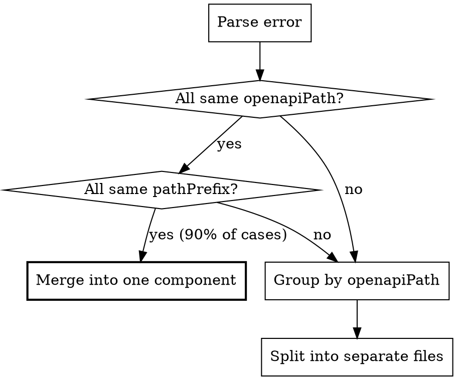

# Fixing Multiple OpenAPIPath Components

## Overview

The `doom-lint:no-multi-open-api-paths` rule enforces that each document file contains **at most one** `<OpenAPIPath>` component. Multiple `OpenAPIPath` components must be combined into a single component by passing all paths as an array to the `path` prop.

**Core principle:** Never use multiple `<OpenAPIPath>` components in a single file. Combine them into one `<OpenAPIPath path={[...]} />` with all paths in a single array.

## When to Use

- `doom lint` outputs: ``Multiple `OpenAPIPath` components are used in the same file``
- A document has two or more `<OpenAPIPath ... />` JSX elements
- Migrating existing API docs that were written with separate components per path

## Error Message

```
Multiple `OpenAPIPath` components are used in the same file, combine them into a single component by passing an array to the `path` prop instead
```

The error points to the **second and subsequent** `<OpenAPIPath>` components in the file. The first one is not flagged.

## Fix Decision Flow



## Fix Patterns

### 1. Combine String Paths into Array (Most Common)

Multiple `<OpenAPIPath>` with simple string `path` props and no other differing props.

```mdx
{/* BEFORE -- two separate components, triggers error */}

<OpenAPIPath path="/api/v1/users" />

<OpenAPIPath path="/api/v1/users/{id}/roles" />

{/* AFTER -- single component with array path */}

<OpenAPIPath path={["/api/v1/users", "/api/v1/users/{id}/roles"]} />
```

### 2. Merge When One Already Uses an Array

One component already has an array `path` prop — flatten all paths into that array.

```mdx
{/* BEFORE -- one array, one string */}

<OpenAPIPath
  path={[
    "/platform/events.alauda.io/v1/events",
    "/platform/events.alauda.io/v1/projects/{project}/clusters/{cluster}/namespaces/{namespace}/events",
  ]}
/>

<OpenAPIPath path="/platform/events.alauda.io/v1/events/{id}" />

{/* AFTER -- all paths in one array */}

<OpenAPIPath
  path={[
    "/platform/events.alauda.io/v1/events",
    "/platform/events.alauda.io/v1/projects/{project}/clusters/{cluster}/namespaces/{namespace}/events",
    "/platform/events.alauda.io/v1/events/{id}",
  ]}
/>
```

### 3. Preserve Shared Props

When all components share the same `openapiPath` or `pathPrefix`, keep them on the merged component.

```mdx
{/* BEFORE -- same openapiPath on both */}

<OpenAPIPath path="/api/projects" openapiPath="project-service.yaml" />

<OpenAPIPath path="/api/projects/{id}" openapiPath="project-service.yaml" />

{/* AFTER -- merged with shared prop preserved */}

<OpenAPIPath
  path={["/api/projects", "/api/projects/{id}"]}
  openapiPath="project-service.yaml"
/>
```

### 4. Different `openapiPath` -- Cannot Merge, Must Split Files

When components reference different OpenAPI specs, they **cannot** be combined into one component because `openapiPath` accepts a single value. Move each group into its own file.

```mdx
{/* CANNOT merge -- different openapiPath values */}

<OpenAPIPath path="/api/users" openapiPath="user-service.yaml" />

<OpenAPIPath path="/api/posts" openapiPath="post-service.yaml" />
```

**Resolution:** Split into separate document files, one per `openapiPath`. Each file gets a single `<OpenAPIPath>` component.

The same applies if components have different `pathPrefix` values that can't be reconciled.

## Component Reference

The `OpenAPIPath` component accepts these props:

| Prop          | Type                 | Required | Description                         |
| ------------- | -------------------- | -------- | ----------------------------------- |
| `path`        | `string \| string[]` | Yes      | One or more OpenAPI paths to render |
| `openapiPath` | `string`             | No       | Specific OpenAPI spec file to use   |
| `pathPrefix`  | `string`             | No       | Gateway path prefix override        |

The component normalizes `path` to an array internally — both `path="/a"` and `path={["/a"]}` are equivalent.

## Batch Fix Strategy

When many errors exist across multiple files:

1. Run `doom lint`, capture all `no-multi-open-api-paths` errors
2. Group by **file path** (each error message includes source location)
3. For each file:
   - Read the file
   - Find all `<OpenAPIPath ... />` components
   - Check if `openapiPath` and `pathPrefix` are identical across all instances (or all absent)
   - If compatible: collect all `path` values, combine into a single `<OpenAPIPath path={[...]} />`
   - If incompatible: split content into separate files
   - Write back once per file
4. Re-run `doom lint` to verify

## Path Value Extraction

When reading existing `path` props to combine them:

| Source Format                 | Extracted Paths        |
| ----------------------------- | ---------------------- |
| `path="/api/users"`           | `["/api/users"]`       |
| `path={"/api/users"}`         | `["/api/users"]`       |
| `path={["/api/a", "/api/b"]}` | `["/api/a", "/api/b"]` |

All extracted paths go into a single `path={[...]}` array on the merged component.

## Common Mistakes

| Mistake                                                                       | Why It Fails                                                             | Fix                                                                        |
| ----------------------------------------------------------------------------- | ------------------------------------------------------------------------ | -------------------------------------------------------------------------- |
| Keeping multiple `<OpenAPIPath>` with only one path each                      | Rule requires exactly one component per file                             | Combine all `path` values into one component's array                       |
| Merging components with different `openapiPath`                               | Single component can only reference one OpenAPI spec                     | Split into separate files instead                                          |
| Passing an array to `openapiPath` (e.g. `openapiPath={["a.yaml", "b.yaml"]}`) | `openapiPath` is typed `string`, NOT `string[]` — this breaks at runtime | One `<OpenAPIPath>` per file per OpenAPI spec; split files if specs differ |
| Duplicating paths in the merged array                                         | Redundant rendering of the same API path                                 | Deduplicate paths when merging                                             |
| Forgetting to remove the extra `<OpenAPIPath>` elements                       | Original components still present after adding merged one                | Delete all original components, replace with single merged one             |
| Wrapping single path in array unnecessarily                                   | Not wrong, but `path="/a"` is cleaner than `path={["/a"]}`               | Use string form for single path, array only for multiple                   |
