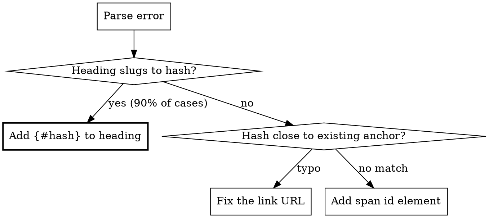

# Fixing Unmatched Anchor Errors

## Overview

The `doom-lint:no-unmatched-anchor` rule ensures anchor links (`#hash`) only reference **explicitly defined custom IDs** — never auto-generated heading slugs. This guarantees anchor stability across translations where heading text differs but anchor targets must be identical.

**Core principle:** Every heading targeted by an anchor link MUST have a custom ID. Use `{#custom-id}` in `.md` files, `\{#custom-id}` in `.mdx` files (braces are JSX expression delimiters in MDX and must be escaped). Auto-slugs don't count.

## When to Use

- `doom lint` outputs: `Unmatched anchor ...`
- Headings are referenced by `[text](#id)` links but lack `{#id}`
- Cross-language docs need stable anchor references
- Error message matches: ``Unmatched anchor `X` in link `Y`, expected one of [...] in file `Z` ``

## Error Message Anatomy

```
Unmatched anchor `{hash}` in link `{url}`, expected one of [`a`, `b`] in file `{filepath}`
```

| Field      | Meaning                                                               |
| ---------- | --------------------------------------------------------------------- |
| `hash`     | The anchor fragment being referenced                                  |
| `url`      | Full link containing `#{hash}` — may include path for cross-file refs |
| `expected` | All custom IDs currently defined in target file (may be empty `[]`)   |
| `filepath` | Target file relative to docs root                                     |

## Fix Decision Flow



## Fix Patterns

### 1. Add Custom ID to Heading (Most Common)

A heading exists whose slug matches the hash, but it lacks an explicit custom ID.

````markdown
<!-- BEFORE — heading has no custom ID, link triggers error -->

## Sidebar Configuration

[See sidebar](#sidebar-configuration)

<!-- AFTER (.md file) — custom ID added -->

## Sidebar Configuration {#sidebar-configuration}

[See sidebar](#sidebar-configuration)
````

**In `.mdx` files**, escape the brace to avoid JSX parse errors:

````mdx
## Sidebar Configuration \{#sidebar-configuration}
````

**Cross-language — same `{#id}` on every translation:**

````markdown
<!-- en/usage/config.md -->

## Sidebar Configuration {#sidebar-configuration}

<!-- zh/usage/config.md -->

## 侧边栏配置 {#sidebar-configuration}

<!-- For .mdx files, use \{#sidebar-configuration} in both -->
````

### 2. Fix Typo in Link

The hash is close to but doesn't match an existing custom ID. The `expected one of [...]` list in the error message shows available anchors — pick the closest match.

```markdown
<!-- BEFORE — typo: "configration" -->

[See config](#sidebar-configration)

<!-- AFTER — corrected to match existing {#sidebar-configuration} -->

[See config](#sidebar-configuration)
```

### 3. Add Anchor Element (No Matching Heading)

When the anchor target isn't a heading (e.g., a specific paragraph or section marker):

```markdown
<!-- Use span with id attribute -->

<span id="custom-anchor"></span>

Content that needs an anchor target...
```

**In MDX files**, JSX syntax works:

```mdx
<span id="custom-anchor" />
```

## Recognized Anchor Sources

The rule collects anchors from exactly three sources:

| Source | `.md` syntax | `.mdx` syntax | Example ID extracted |
| --- | --- | --- | --- |
| Custom heading ID | `## Title {#id}` | `## Title \{#id}` | `id` |
| JSX `id` attribute | N/A | `<span id="id" />` | `id` |
| HTML `id` attribute | `<div id="id"></div>` | `<div id="id"></div>` | `id` |

**NOT recognized:** auto-generated slugs from heading text, `<a name="...">`, double-escaped `\\{#id}`.

## Batch Fix Strategy

When many errors exist:

1. Run `doom lint`, capture all `no-unmatched-anchor` errors
2. Group by **target file** (the file in `in file \`...\``)
3. For each target file:
   - Read the file
   - For each missing anchor, find the heading and add `{#hash}` (or `\{#hash}` for `.mdx`)
   - Write back once (not per-anchor)
4. For cross-file refs: fix the **target file**, not the linking file
5. Re-run `doom lint` to verify

## Common Mistakes

| Mistake                                    | Why It Fails                                    | Fix                                     |
| ------------------------------------------ | ----------------------------------------------- | --------------------------------------- |
| Relying on auto-slug `## Title` → `#title` | Rule ignores auto-slugs by design | Add `{#title}` (`.md`) or `\{#title}` (`.mdx`) |
| Adding `{#id}` only in primary language | Other language files still lack the anchor | Add same `{#id}` / `\{#id}` to ALL translations |
| Using `<a name="id">` | Rule only recognizes `id` attribute, not `name` | Use `<span id="id"></span>` |
| Using `{#id}` in `.mdx` without escaping | MDX parser treats `{}` as JSX expression → parse error | Escape: `\{#id}` |
| Fixing the link instead of the heading | Link is correct; heading is missing the anchor | Add custom ID to the heading |
| Ignoring `expected one of []` (empty list) | File has zero custom IDs | Add custom ID to every referenced heading |

## Excluded From This Rule

- External URLs (`https://...`)
- API docs paths (`{lang}/apis/...`) — anchors are dynamically generated
- Non-existent target files — handled by `doom-lint:check-dead-links` instead
- Files outside the configured docs root
